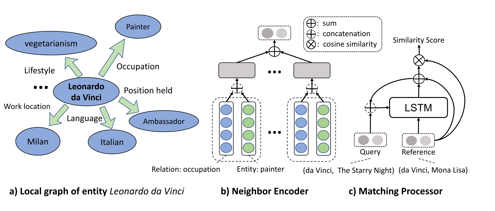

# One-Shot-Knowledge-Graph-Reasoning

PyTorch implementation of the One-Shot relational learning model described in our EMNLP 2018 paper [One-Shot Relational Learning for Knowledge Graphs](https://arxiv.org/abs/1808.09040). In this work, we attempt to automatically infer new facts about a particular relation given only one training example. For instance, given the fact the "the Arlanda Airport is located in city Stochholm", the algorithm proposed in this papers tries to automatically infer that "the Haneda Airport is located in Tokyo" by utilizing the knowledge graph information about the involved entities (i.e. the Arlanda Airport, Stochholm, the Haneda Airport and Tokyo).

## Method illustration

<p align="center"></p>

The main idea of this model is a matching network that encodes the one-hop neighbors of the involved entities, as defined in ``matcher.py``.

## Steps to run the experiments

### Requirements
* ``Python 3.6.5 ``
* ``PyTorch 0.4.1``
* ``tensorboardX``
* ``tqdm``

### Datasets
* Download datasets [Wiki-One](https://sites.cs.ucsb.edu/~xwhan/datasets/wiki.tar.gz) and [NELL-One](https://sites.cs.ucsb.edu/~xwhan/datasets/nell.tar.gz)


### Pre-trained embeddings
* [Wiki-One](https://drive.google.com/file/d/1_3HBJde2KVMhBgJeGN1-wyvW88gRU1iL/view?usp=sharing)
* [NELL-One](https://drive.google.com/file/d/1XXvYpTSTyCnN-PBdUkWBXwXBI99Chbps/view?usp=sharing)


### Training
* With random initialized embeddings: ``CUDA_VISIBLE_DEVICES=0 python trainer.py --max_neighbor 50  --fine_tune``
* With pretrained embeddings: ``CUDA_VISIBLE_DEVICES=0 python trainer.py --max_neighbor 50  --fine_tune --embed_model ComplEx``

### Visualization
``tensorboard --logdir logs``

### Reference
```
@inproceedings{Xiong_Oneshot,
  author    = {Wenhan Xiong and
               Mo Yu and
               Shiyu Chang and
               Xiaoxiao Guo and
               William Yang Wang},
  title     = {One-Shot Relational Learning for Knowledge Graphs},
  booktitle = {Proceedings of the 2018 Conference on Empirical Methods in Natural
               Language Processing, Brussels, Belgium, October 31 - November 4, 2018},
  pages     = {1980--1990},
  publisher = {Association for Computational Linguistics},
  year      = {2018},
  url       = {https://aclanthology.info/papers/D18-1223/d18-1223},
  timestamp = {Sat, 27 Oct 2018 20:04:50 +0200},
}
```
